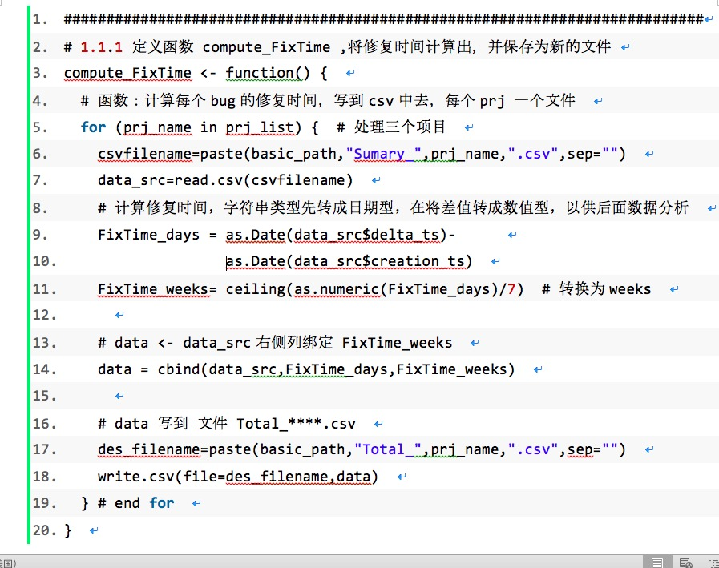

# 毕业设计论文撰写总体要求

## 一、 常用软件
1. 论文撰写：使用 MS-Word （Office 2010 以上版本），不接受其他软件输出的文档（Word 兼容文档存在问题！）南通大学[微软软件正版化下载安装指南](./MS_Guide.md)
2. 画图：
   + 使用 Visio画，字号 10pt 、宋体 
   + 或者在线绘图[ProcessOn网站](http://www.processon.com) ``免费``
3. 表格：使用 word 插入表格，字号 10pt 、宋体
4. 代码：统一使用 `PlanetB网站` [点击网站链接](http://www.planetb.ca/syntax-highlight-word) 帮助转换后，复制到 Word文档中。 

## 二、 内容要求
1. 总页数不低于46页。 PS：低于46页不得参加答辩。
2. 文字通顺、错别字不超过 3 个。  PS：验收时，发现病句 or 错别字 超过 3+3 处，直接打回重新打印。
3. 另外，论文尽量避免使用第一人称（我、我们等），只有致谢部分 可以用第一人称.
4. 英文缩写：同学们 在写论文时，请注意一下，【[常用英文缩小的固定表达链接](http://www.cnblogs.com/juking/p/6878570.html)】（不能随意写） 
5. 常见错误示例：
     +   `Java` 不能写成 `JAVA`形式，
     +   `JUnit` 不能写成 `JUNIT`，
     +   `WPS`  不能写成 `wps` 
     +   `Windows` 不能写成 `windows`
     +   `MySQL` 不能写成 `mysql` 等
     +   ... ... 
     

## 三、 图、表、代码的要求

### 1. 图的绘制
              
1. 图题在图的正下方居中，如示例： 
   + 图3.4 ****图   
   + 解释：3 表示第3章， 4 为该章的第4张图。
2. 图中文字为5号宋体。 
3. 绘图尽量用 Visio，禁止用 Word直接画。
   + 如果用visio 画图，可以 在visio 中，ctrl +A ，ctrl +c 然后到word中 ctrl +v
4. 线：横平竖直； 尽量不相交。
5. 框：文字尽量少，一行文字尽量语义完整，与其他框尽量水平、垂直对齐，大小一致；
6. 图示例如下：

 

图3.4 Latex与Word耗费代价对比 （标题放在插图正下面）

7. 在介绍图时，正确方法是：
   +   **** `如图 3-2 所示`，****
   +   不要这样说： `"整个系统流程图如下图"`
   +   你写`"如下图"` , 万一图跑到下一页呢？

### 2. 表的绘制
1. 表题在图的上方居中，如示例：  
   + 表3-4 *******   
   + 解释：PS：3 表示第3章， 4 为该章的第4张表。图中文字为5号宋体。
   + 尽量采用三线表 (标题放在表格上面） 
2. 表的字号要比正文小一号（五号）、单倍行距   
3. 表示例如下：          

表3-4 学生信息

|姓名|年龄|性别|
|:--|--:|--:|
| 张三| 18| 女  |
| 小明| 23| 男  |

### 3. 代码的绘制
1. 用文本框框起来，字号（五号），行间距单倍行距。只贴核心的、关键的代码。
   1. 可读性要好！
   2. 要注意代码的缩进
        
2. 如何在Word中贴代码？
   1. 生成贴代码的 [网站: PlanetB](http://www.planetb.ca/syntax-highlight-word)
   2. 如何生成可贴到Word中的代码片段？ [教程](https://blog.csdn.net/u011303443/article/details/50992651)
   
3.  代码示例如下
   

## 四、格式要求
1. 页眉页脚，正文部分必须添加页眉页脚
2. 所有英文 Times new Roams。 PS：Ctrl +A 全选，设置字体即可
3. 所有章节之间用分节符分割。利用菜单【插入】--【分节符】实现
4. 图形不宜过多过大，禁止截屏贴图，图形只选取与内容相关部分。
5. 按照模版设置行间距、段落间距等

